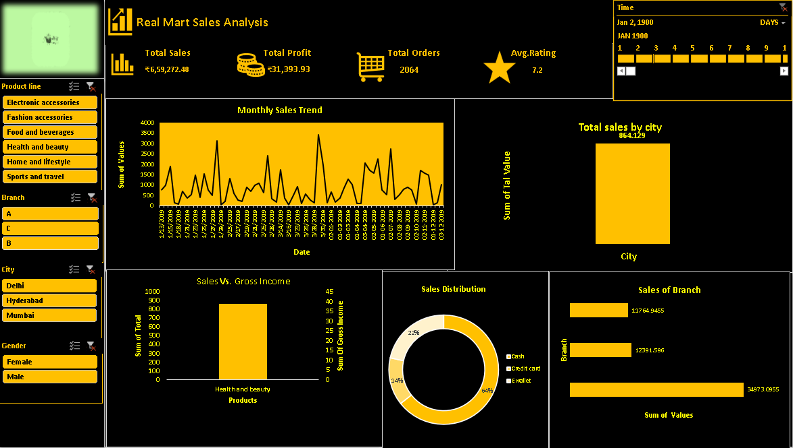

# Real-Mart-Sales-Dashboard
Interactive Excel dashboard analyzing Real Mart retail sales, profit trends and customer segmentation

# Real Mart Sales Analysis Dashboard
### Tools: Excel | Power Query | Pivot Tables | Power Pivot

## Dashboard Preview

## Overview
End-to-end interactive Excel sales dashboard to monitor 
revenue trends, profit margins, and customer segmentation KPIs.

## Key KPIs
| Metric | Value |
|--------|-------|
| Total Sales | ₹6,59,272.48 |
| Total Profit | ₹31,393.93 |
| Total Orders | 2064 |
| Avg Rating | 7.2 |

## Key Insights
- Health & Beauty is top performing product category
- E-wallet dominates payments at 64%
- Branch A leads sales with ₹11764
- Delhi, Hyderabad, Mumbai covered across branches
- Monthly sales trend shows strong mid-year peaks
